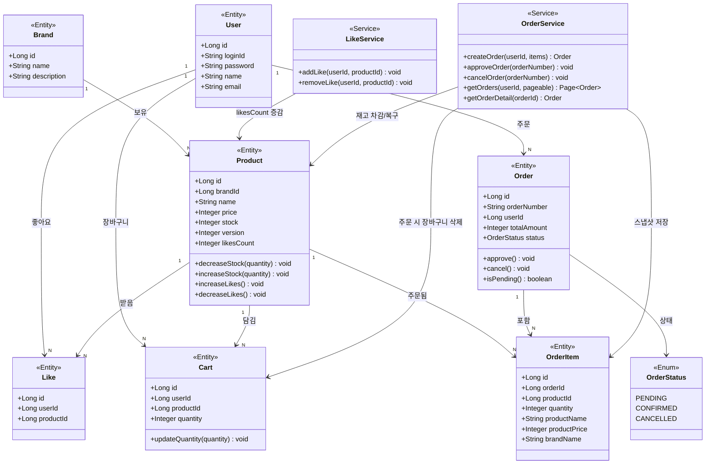

```mermaid
classDiagram
    %% ============================================
    %% 공통 아키텍처 패턴
    %% Controller → Facade → Service → Repository
    %% ============================================

    %% ============================================
    %% Entity 정의
    %% ============================================

    class User {
        <<Entity>>
        +Long id
        +String loginId
        +String password
        +String name
        +String email
    }

    class Brand {
        <<Entity>>
        +Long id
        +String name
        +String description
    }

    class Product {
        <<Entity>>
        +Long id
        +Long brandId
        +String name
        +Integer price
        +Integer stock
        +Integer version
        +Integer likesCount
        +decreaseStock(quantity) void
        +increaseStock(quantity) void
        +increaseLikes() void
        +decreaseLikes() void
    }

    class Like {
        <<Entity>>
        +Long id
        +Long userId
        +Long productId
    }

    class Cart {
        <<Entity>>
        +Long id
        +Long userId
        +Long productId
        +Integer quantity
        +updateQuantity(quantity) void
    }

    class Order {
        <<Entity>>
        +Long id
        +String orderNumber
        +Long userId
        +Integer totalAmount
        +OrderStatus status
        +approve() void
        +cancel() void
        +isPending() boolean
    }

    class OrderItem {
        <<Entity>>
        +Long id
        +Long orderId
        +Long productId
        +Integer quantity
        +String productName
        +Integer productPrice
        +String brandName
    }

    class OrderStatus {
        <<Enum>>
        PENDING
        CONFIRMED
        CANCELLED
    }

    %% ============================================
    %% 도메인 관계
    %% ============================================

    Brand "1" --> "N" Product : 보유
    User "1" --> "N" Like : 좋아요
    User "1" --> "N" Cart : 장바구니
    User "1" --> "N" Order : 주문
    Product "1" --> "N" Like : 받음
    Product "1" --> "N" Cart : 담김
    Product "1" --> "N" OrderItem : 주문됨
    Order "1" --> "N" OrderItem : 포함
    Order --> OrderStatus : 상태

    %% ============================================
    %% 주요 Service 간 의존 관계
    %% ============================================

    class LikeService {
        <<Service>>
        +addLike(userId, productId) void
        +removeLike(userId, productId) void
    }

    class OrderService {
        <<Service>>
        +createOrder(userId, items) Order
        +approveOrder(orderNumber) void
        +cancelOrder(orderNumber) void
        +getOrders(userId, pageable) Page~Order~
        +getOrderDetail(orderId) Order
    }

    LikeService --> Product : likesCount 증감
    OrderService --> Product : 재고 차감/복구
    OrderService --> Cart : 주문 시 장바구니 삭제
    OrderService --> OrderItem : 스냅샷 저장

```

