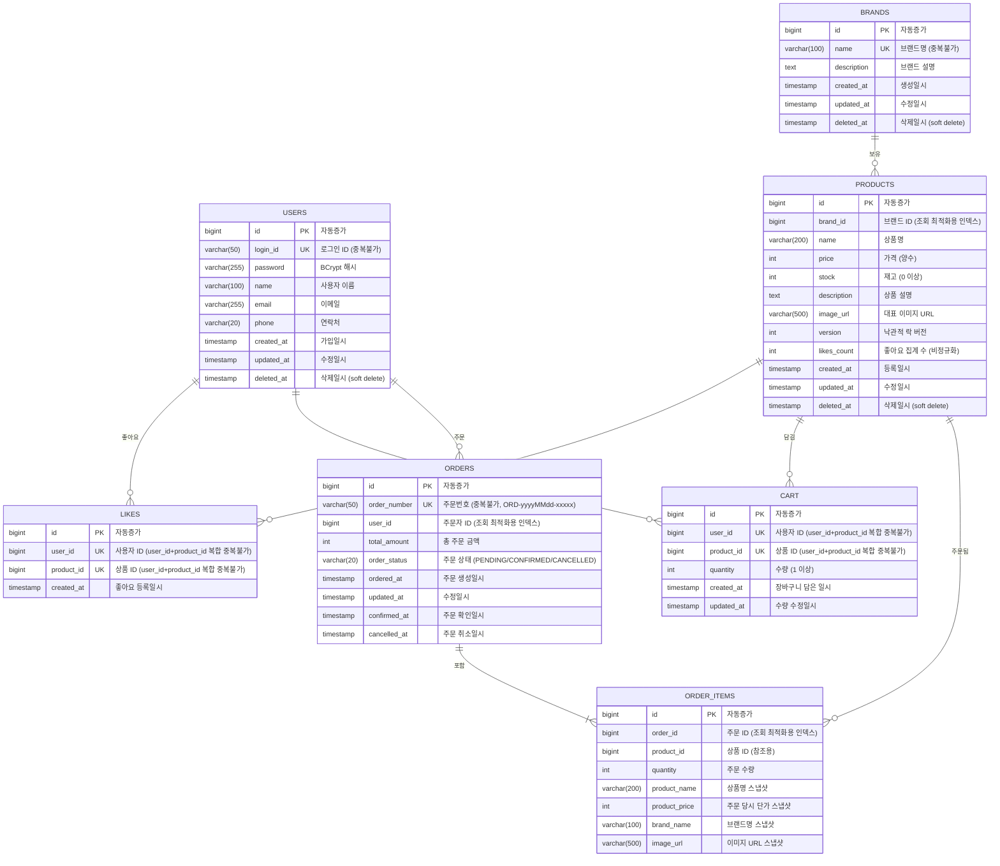

```mermaid
erDiagram
    %% ========================================
    %% 사용자 영역
    %% ========================================
    USERS {
        bigint id PK "자동증가"
        varchar(50) login_id UK "로그인 ID (중복불가)"
        varchar(255) password "BCrypt 해시"
        varchar(100) name "사용자 이름"
        varchar(255) email "이메일"
        varchar(20) phone "연락처"
        timestamp created_at "가입일시"
        timestamp updated_at "수정일시"
        timestamp deleted_at "삭제일시 (soft delete)"
    }

    %% ========================================
    %% 브랜드 & 상품 영역
    %% ========================================
    BRANDS {
        bigint id PK "자동증가"
        varchar(100) name UK "브랜드명 (중복불가)"
        text description "브랜드 설명"
        timestamp created_at "생성일시"
        timestamp updated_at "수정일시"
        timestamp deleted_at "삭제일시 (soft delete)"
    }

    PRODUCTS {
        bigint id PK "자동증가"
        bigint brand_id "브랜드 ID (조회 최적화용 인덱스)"
        varchar(200) name "상품명"
        int price "가격 (양수)"
        int stock "재고 (0 이상)"
        text description "상품 설명"
        varchar(500) image_url "대표 이미지 URL"
        int version "낙관적 락 버전"
        int likes_count "좋아요 집계 수 (비정규화)"
        timestamp created_at "등록일시"
        timestamp updated_at "수정일시"
        timestamp deleted_at "삭제일시 (soft delete)"
    }

    %% ========================================
    %% 좋아요 / 장바구니
    %% ========================================
    LIKES {
        bigint id PK "자동증가"
        bigint user_id UK "사용자 ID (user_id+product_id 복합 중복불가)"
        bigint product_id UK "상품 ID (user_id+product_id 복합 중복불가)"
        timestamp created_at "좋아요 등록일시"
    }

    CART {
        bigint id PK "자동증가"
        bigint user_id UK "사용자 ID (user_id+product_id 복합 중복불가)"
        bigint product_id UK "상품 ID (user_id+product_id 복합 중복불가)"
        int quantity "수량 (1 이상)"
        timestamp created_at "장바구니 담은 일시"
        timestamp updated_at "수량 수정일시"
    }

    %% ========================================
    %% 주문 영역
    %% ========================================
    ORDERS {
        bigint id PK "자동증가"
        varchar(50) order_number UK "주문번호 (중복불가, ORD-yyyyMMdd-xxxxx)"
        bigint user_id "주문자 ID (조회 최적화용 인덱스)"
        int total_amount "총 주문 금액"
        varchar(20) order_status "주문 상태 (PENDING/CONFIRMED/CANCELLED)"
        timestamp ordered_at "주문 생성일시"
        timestamp updated_at "수정일시"
        timestamp confirmed_at "주문 확인일시"
        timestamp cancelled_at "주문 취소일시"
    }

    ORDER_ITEMS {
        bigint id PK "자동증가"
        bigint order_id "주문 ID (조회 최적화용 인덱스)"
        bigint product_id "상품 ID (참조용)"
        int quantity "주문 수량"
        varchar(200) product_name "상품명 스냅샷"
        int product_price "주문 당시 단가 스냅샷"
        varchar(100) brand_name "브랜드명 스냅샷"
        varchar(500) image_url "이미지 URL 스냅샷"
    }

    %% ========================================
    %% 논리적 관계 정의 (물리적 FK 제약조건 없음)
    %% ========================================
    
    %% 브랜드 → 상품
    BRANDS ||--o{ PRODUCTS : "보유"
    
    %% 사용자 → 좋아요/장바구니/주문
    USERS ||--o{ LIKES : "좋아요"
    USERS ||--o{ CART : "장바구니담기"
    USERS ||--o{ ORDERS : "주문"
    
    %% 상품 → 좋아요/장바구니/주문항목
    PRODUCTS ||--o{ LIKES : "좋아요받음"
    PRODUCTS ||--o{ CART : "담김"
    PRODUCTS ||--o{ ORDER_ITEMS : "주문됨"
    
    %% 주문 → 주문항목
    ORDERS ||--|{ ORDER_ITEMS : "포함"

```